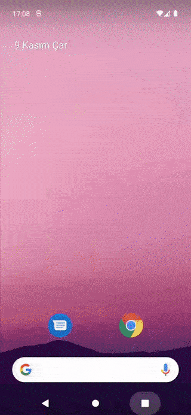
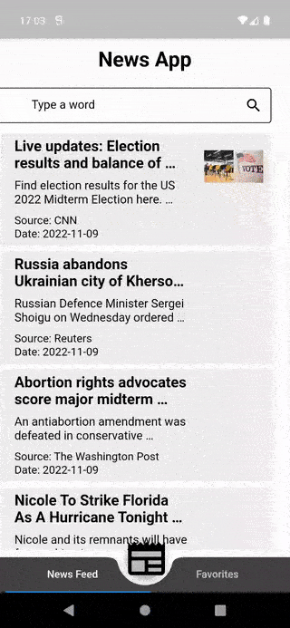
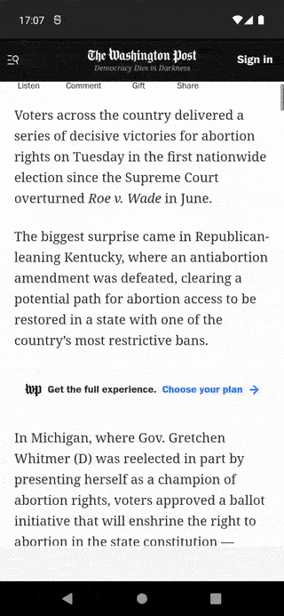
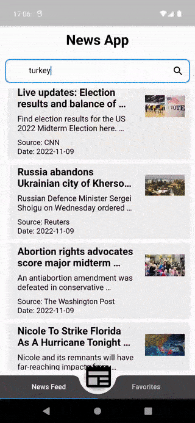

# NewsFeedApp

This application provides a news feed to the user by pulling data from a remote API. User can add news to favorites, view news details and access content source with webview.

<h3 align="left">Screenshots</h3>

 
 
   
  
 
 
   
  
 
 
   
  